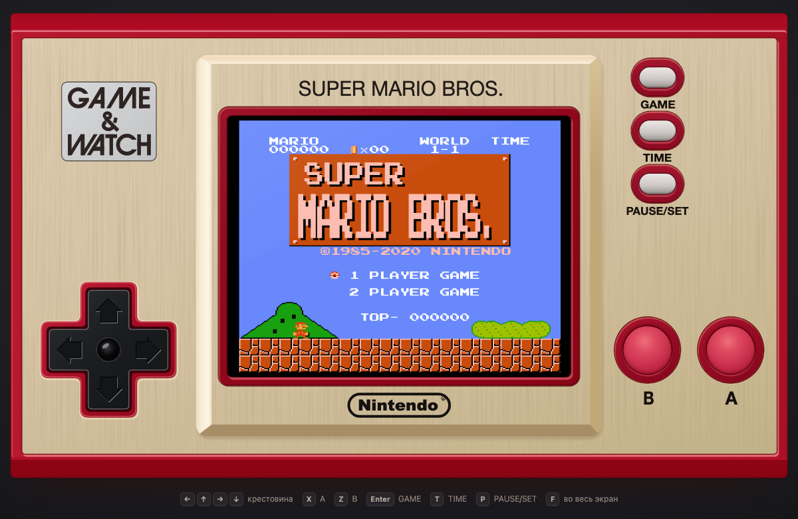
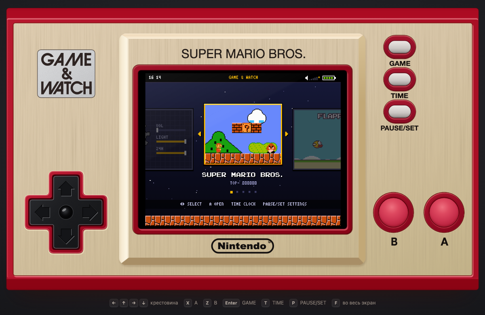

# Game & Watch: Super Mario Bros. — веб-копия

Браузерная копия карманной приставки **Game & Watch: Super Mario Bros.** Корпус воссоздан 1:1 по фотографии, внутри — своя маленькая «ОС» и четыре приложения. Без сборки, без зависимостей, работает офлайн.

## Что внутри

- **Super Mario Bros.** — уровень 1-1 с бонус-комнатой, флагштоком и замком, плюс подземный 1-2 (своя разметка). Грибы, огненный цветок, звезда, гумбы, купы с панцирями, таймер, жизни, игра на двоих (Марио и Луиджи).
- **Ball** — игра Game & Watch 1980 года в стиле ЖК-сегментов, жонглирует Марио. Режимы Game A и Game B.
- **Flappy Bird** — день и ночь, медали, рекорд.
- **Интерактивные часы** — цифры из кирпичей: каждую минуту Марио ударом головы меняет цифру. Им можно управлять; есть темы (день, ночь, подземелье, замок), фейерверк каждый час и будильник.
- **ОС** — включение, загрузка, меню-карусель, настройки (громкость, яркость, 12/24 ч, время, будильник), пауза. Рекорды и настройки сохраняются в браузере.

## Запуск

- Открыть `index.html` в браузере — и всё.
- Или локальный сервер: `node server.js`, затем http://localhost:8765
- Или GitHub Pages: **Settings → Pages → Deploy from a branch → `main`, папка `/ (root)`**.

Звук включается после первого нажатия — так устроены браузеры.

## Управление

| Клавиатура | Кнопка |
|---|---|
| ← ↑ → ↓ | крестовина |
| X | A |
| Z | B |
| Enter | GAME |
| T | TIME |
| P | PAUSE/SET |
| F | полный экран |

Кнопки на корпусе нажимаются мышью и пальцем, геймпад тоже поддерживается.

- **GAME** — в меню, **TIME** — часы, **PAUSE/SET** — пауза.
- **Mario:** A — прыжок, B — бег и огненный шар, ↓ — присесть или залезть в трубу.
- **Ball:** ← → (или B / A) — двигать руки.
- **Flappy Bird:** A — взмах.
- **Часы:** ← → — идти, A — прыжок, B — тема, ↑ — 12/24 ч, PAUSE/SET — настройка времени и будильника.

## Как устроено

Чистый JavaScript без библиотек: картинка рисуется в `<canvas>`, звук синтезируется через Web Audio (4-канальный чиптюн-синтезатор), корпус — HTML, CSS и SVG.

| Файл | Что делает |
|---|---|
| `index.html`, `css/style.css` | корпус приставки |
| `js/core.js` | общие утилиты и сохранения |
| `js/gfx.js` | палитра, спрайты, пиксельные шрифты |
| `js/sprites.js` | пиксель-арт |
| `js/audio.js` | звуки и музыка |
| `js/input.js` | клавиатура, геймпад, нажатия |
| `js/device.js` | масштаб, крестовина, вывод на экран |
| `js/os.js` | ОС: загрузка, меню, настройки, пауза, будильник |
| `js/apps/` | Mario, Ball, Flappy Bird, часы |
| `js/main.js` | игровой цикл 60 FPS |
| `server.js` | необязательный локальный сервер |

## Дисклеймер

Неофициальный некоммерческий фан-проект, не связан с Nintendo. Nintendo, Game & Watch, Super Mario Bros. и связанные персонажи — товарные знаки Nintendo; Flappy Bird — .GEARS Studios. В проекте нет ROM-файлов и кода Nintendo: графика перерисована вручную, музыка — оригинальная.

---

## English

A browser replica of the **Game & Watch: Super Mario Bros.** handheld. The shell is recreated 1:1 from a product photo and runs a tiny "OS" with four apps: Super Mario Bros. (World 1-1 with its bonus room, plus an underground 1-2), Ball (the 1980 Game & Watch juggling game, starring Mario), Flappy Bird and an interactive clock where Mario head-bumps the digits every minute.

No build step and no dependencies: open `index.html`, run `node server.js`, or host it on GitHub Pages.

Controls: arrows — D-pad, X — A, Z — B, Enter — GAME, T — TIME, P — PAUSE/SET, F — fullscreen. Touch and gamepads work too.

Unofficial non-commercial fan project, not affiliated with Nintendo. All trademarks belong to their respective owners. No Nintendo ROMs or code are included; the graphics are redrawn by hand and the music is original.
